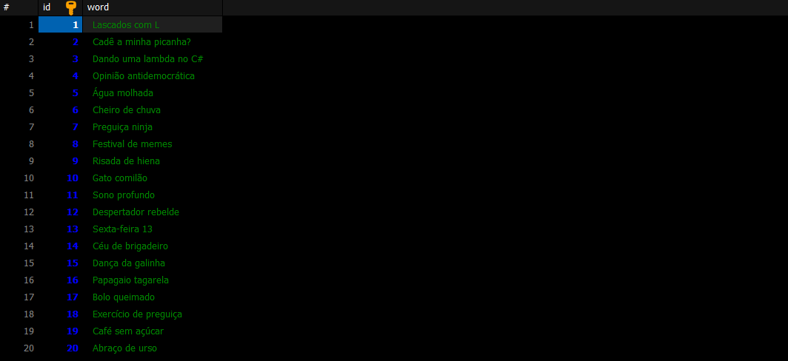
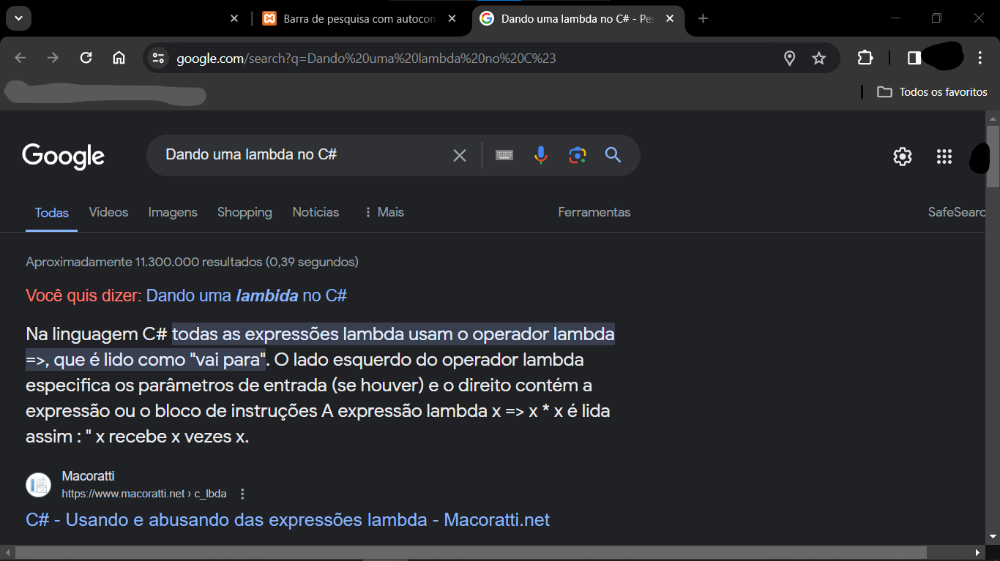

# BUSCADOR EM PHP E MARIADB
💬FORMULÁRIO BUSCADOR/PESQUISADOR (SEARCH) COM SUGESTÕES BASEADO NO DATABASE MARIADB!

 <br><br>
 <br><br>
 <br>

## DESCRIÇÃO:
O projeto consiste na implementação de uma barra de pesquisa com recurso de autocomplete, onde os usuários podem inserir consultas de pesquisa e obter sugestões conforme digitam. O autocomplete sugere possíveis palavras com base nas entradas do usuário, facilitando a descoberta e seleção de termos relevantes.

## CARACTERISTICAS:
1. Barra de Pesquisa: Os usuários podem inserir consultas de pesquisa na barra de pesquisa.
2. Autocomplete: À medida que os usuários digitam na barra de pesquisa, sugestões relevantes são exibidas abaixo, proporcionando uma experiência de autocomplete.
3. Visual Atraente: O projeto inclui um layout visualmente atraente e responsivo, com estilo moderno e agradável.
4. Funcionalidade de Pesquisa: Os usuários podem clicar nas sugestões de pesquisa para preencher automaticamente a barra de pesquisa com o termo selecionado. Além disso, eles também podem clicar em um ícone de lupa para realizar a pesquisa em uma nova aba.

## EXECUTANDO O PROJETO:
1. **Configuração do Banco de Dados:**
   - Antes de executar o site, é necessário importar o arquivo `DATABASE.sql`.

2. **Configuração do PHP:**
   - Abra o arquivo `CODIGO.php` e ajuste as configurações do banco de dados:

     ```php
     $servername = "localhost";
     $username = "seu_usuario";
     $password = "sua_senha";
     $database = "search";
     ```

3. **Executando o Aplicativo com Apache:**
   - Coloque os arquivos em um servidor web compatível com PHP (por exemplo, XAMPP, WAMP, LAMP).
   - Acesse o formulário no navegador visitando [http://localhost/CODIGO/CODIGO.html](http://localhost/CODIGO/CODIGO.html).

4. **Executando o Aplicativo com `php.exe`:**
   - Alternativamente, você pode iniciar o servidor diretamente no diretório `./CODIGO` com o comando abaixo:
   ```bash
   php -S localhost:8080
   ```
   - Em seguida, acesse o formulário no navegador através do endereço: [http://localhost:8080/CODIGO.html](http://localhost:8080/CODIGO.html).

5. **Interagir com a Barra de Pesquisa:**
   - Agora você pode interagir com a barra de pesquisa. Digite uma consulta na barra de pesquisa e veja as sugestões de autocomplete sendo exibidas dinamicamente.
   - Clique em uma sugestão para preencher automaticamente o campo de pesquisa com o termo selecionado.
   - Clique no ícone de lupa para realizar a pesquisa, que abrirá os resultados em uma nova aba.

## NÃO SABE?
- Entendemos que para manipular arquivos em `HTML`, `CSS` e outras linguagens relacionadas, é necessário possuir conhecimento nessas áreas. Para auxiliar nesse aprendizado, oferecemos cursos gratuitos disponíveis:
* [CURSO DE HTML E CSS](https://github.com/VILHALVA/CURSO-DE-HTML-E-CSS)
* [CURSO DE JAVASCRIPT](https://github.com/VILHALVA/CURSO-DE-JAVASCRIPT)
* [CURSO DE PHP](https://github.com/VILHALVA/CURSO-DE-PHP)
* [CURSO DE MARIADB](https://github.com/VILHALVA/CURSO-DE-MARIADB)
* [CONFIRA MAIS CURSOS](https://github.com/VILHALVA?tab=repositories&q=+topic:CURSO)

## SAIBA MAIS:
- [PROJETO CRIADO PELO VILHALVA](https://github.com/VILHALVA)
- [PROJETO INSPIRADO NO "BUSCADOR AUTOCOMPLETE"](https://github.com/VILHALVA/BUSCADOR-AUTOCOMPLETE)
